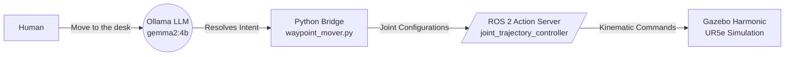

<div align="center">

# 🤖 Mind to Machine: LLM-Controlled UR5e Robotic Arm

[](https://docs.ros.org/en/lyrical/)
[](https://gazebosim.org/)
[](https://www.docker.com/)
[](https://ollama.com/)

*Bridging the gap between cutting-edge Generative AI and classical robotic control architectures.*

</div>

<br/>

## 🎯 What is this?

This project demonstrates a seamless integration between **Large Language Models (LLMs)** and industrial robotics. By typing natural English commands, users can control a highly realistic **Universal Robots UR5e** robotic arm operating in a physics-accurate Gazebo Harmonic simulation.

The system uses `gemma2:4b` (running locally via Ollama) to parse human intent, resolve it into spatial waypoints, and execute the movement using robust ROS 2 action servers.

---

## ✨ Key Features

- **🧠 Natural Language Processing:** Command the robot intuitively without writing a single line of code or calculating joint angles.
- **🦾 Realistic Physics Simulation:** Uses Gazebo Harmonic and `ros2_control` for high-fidelity UR5e kinematics and dynamics.
- **⚡ Local Inference:** Zero cloud reliance. The LLM runs completely on your local GPU, ensuring low latency and data privacy.
- **🐳 1-Click Deployment:** A fully containerized Docker architecture means no messing with messy ROS 2 dependencies on your host machine.

---

## 🏗️ Architecture



---

## 🚀 Quick Start (Plug-and-Play)

We've containerized everything so you can get started in under 5 minutes. 

### Prerequisites
- Docker Engine & Docker Compose
- NVIDIA GPU with [NVIDIA Container Toolkit](https://docs.nvidia.com/datacenter/cloud-native/container-toolkit/latest/install-guide.html) installed
- Ollama (running locally on your host machine)

### 1. Clone & Setup
```bash
git clone https://github.com/harshhh19/6-DOF-arm-.git
cd 6-DOF-arm-
```

### 2. Allow Display Forwarding
Allow Docker to access your local X11 display so the Gazebo GUI can open:
```bash
xhost +local:docker
```

### 3. Launch the Simulation Environment
```bash
docker-compose up
```
> [!NOTE]
> The very first time you run this, Docker will download the Ubuntu/ROS 2 base images. Grab a coffee! Subsequent launches will be instantaneous.

### 4. Control the Robot
Once Gazebo is open and the robot is loaded, open a **new terminal tab** and launch the AI Bridge:
```bash
docker exec -it ur5e-sim python3 /workspace/waypoint_mover.py
```
Type your command (e.g., *"Take the object to the inspection table"*) and watch the robot move!

---

## 🛠️ Built With

* **[ROS 2 Lyrical](https://docs.ros.org/en/lyrical/)**: The backbone of the robotic messaging system.
* **[Gazebo Harmonic](https://gazebosim.org/)**: Next-generation robotics simulator.
* **[Universal_Robots_ROS2_Driver](https://github.com/UniversalRobots/Universal_Robots_ROS2_Driver)**: Official ROS 2 drivers for UR manipulators.
* **[Ollama](https://ollama.com/)**: Fast, local LLM deployment framework.

<br/>

